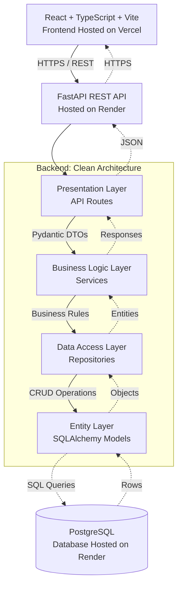

# HR Nexus — Enterprise Human Resource Management System
**Built for the Odoo Hackathon**

## 🌐 Deployed Links
- **Frontend (Live App)**: [https://hr-nexus-three.vercel.app](https://hr-nexus-three.vercel.app)
- **Backend API**: Deployed on [Render](https://render.com)
- **Database**: PostgreSQL (Hosted on Render)

## 📖 Overview
HR Nexus is an enterprise-grade Human Resource Management System engineered with a strict 6-layer clean architecture, separating business logic from HTTP routes and database engines. It is designed to function like a full-fledged enterprise SaaS platform.

## ⚙️ Application Workflow

The application follows a complete end-to-end HR management workflow with dedicated interfaces and logic for different roles:

### 1. Authentication & Role-Based Access
- **Secure Access**: Users log in securely with JWT-based authentication (short-lived access tokens and refresh token rotation).
- **RBAC**: Granular permission dependencies enforce `ADMIN`, `HR_MANAGER`, and `EMPLOYEE` access tiers.

### 2. Employee Self-Service
- **Profile Management**: Employees can update self-service fields (phone, address, emergency contacts). Sensitive data (salary, role, hire date) remains protected and editable only by HR/Admins.
- **Attendance Tracking**: Employees use a check-in/check-out system that automatically computes working hours. It prevents duplicate entries, blocks premature check-outs, and dynamically assigns status (Present, Late, Half-Day, Absent).
- **Leave Management**: Employees can apply for leave. The system automatically calculates business days (excluding weekends) and prevents overlapping leave requests.

### 3. HR Management & Payroll
- **Onboarding & Departments**: HR Managers oversee employee onboarding, department structures, and review attendance reports.
- **Automated Payroll Engine**: Admins can generate payrolls with automated gross, tax, and net salary computations. The engine integrates directly with attendance records for accurate pro-rata deductions.

### 4. Analytics & Auditing
- **Dashboards**: Dedicated analytics endpoints provide data for frontend charting, including attendance percentages, headcount distribution, payroll cost trends, and employee growth curves.
- **Audit Trails**: Immutable audit logs capture snapshots (`old_values` and `new_values`) for every administrative write operation, alongside chronological activity feeds.

## 🏗️ Architecture Diagram

## 🛠️ Tech Stack
- **Frontend**: React, TypeScript, Vite, TailwindCSS (Vercel Deployment)
- **Backend**: Python, FastAPI, SQLAlchemy 2.0 (Async), Pydantic v2 (Render Deployment)
- **Database**: PostgreSQL / SQLite (for local testing)

## 🚀 Getting Started
For detailed instructions on running the application locally, please refer to:
- [Backend Documentation](./backend/README.md)
- [Frontend Documentation](./frontend/README.md)